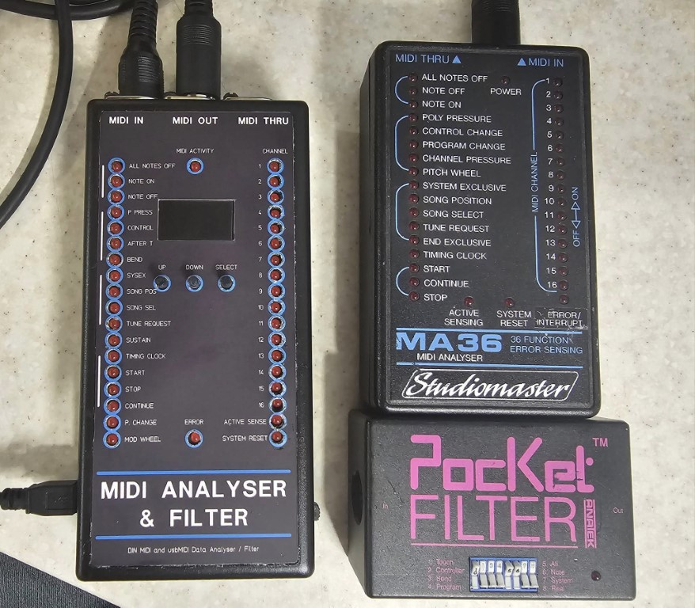

Based on the ancient StudioMaster MA36 midi Analyzer. This is a modern equivalent based on a Teensy 4.0. It can display note on/off, bend, modulation, all notes off, sustain, poly pressure, channel pressure, program changes, general cc messages, system exclusive, song select, song position, tune request, timing clock, start, stop, continue, active sense and system reset. And any relevant channel information. Filtering of certain messge types is possible and also manual transmission of certain messages.

The LEDs show quick information regarding the data and the display will show Note On, Note Off, CC messages, Program Changes and Channel Aftertouch values.

It also supports filtering of midi data on the MIDI output port, menu driven on/off filtering of notes, controllers, aftertouch, program changes etc.

A press and hold the select button switches to the Transmit menu and you can select notes, program changes, CC messages and pressure messages and values to send to the MIDI out. The channel can also be set in the menu and the LEDs will flash to show the message type and channel. Press and old the select button to return to the Filter menu.

The box is battery operated or USB powered.

